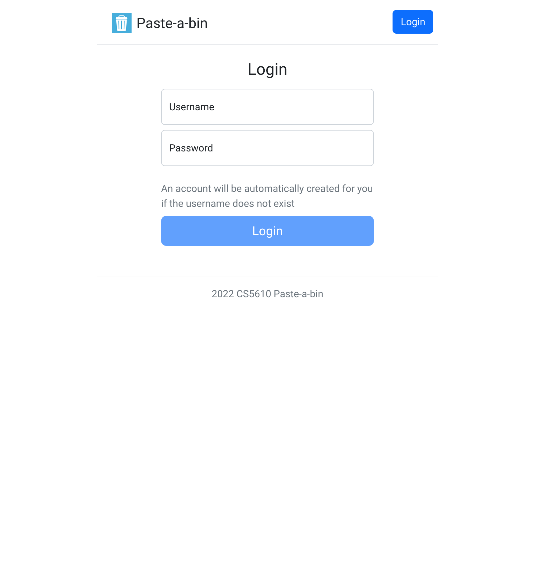
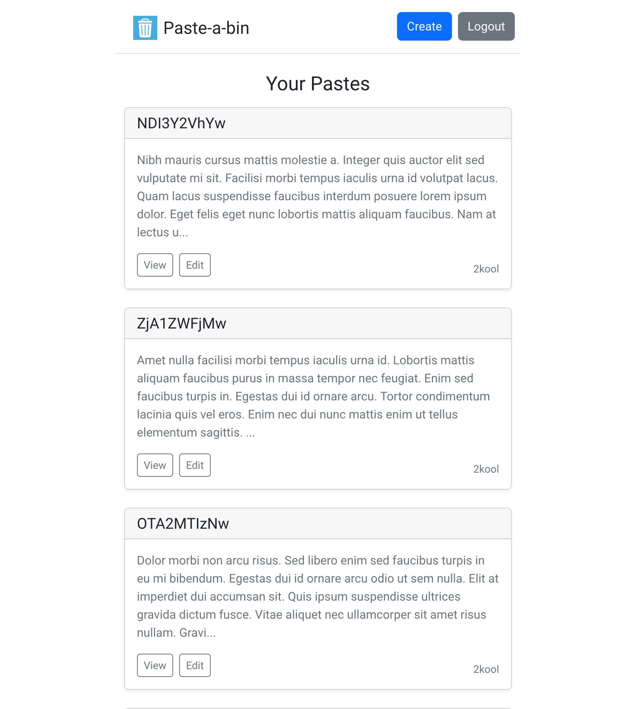
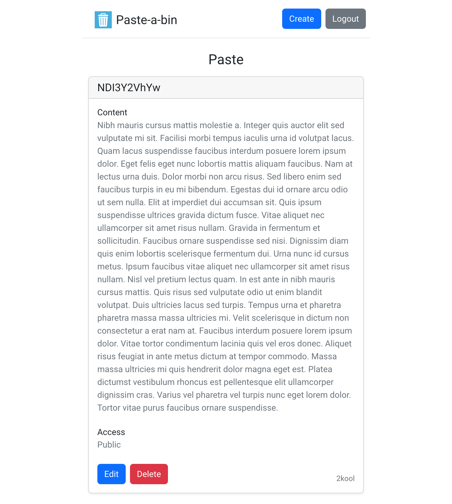
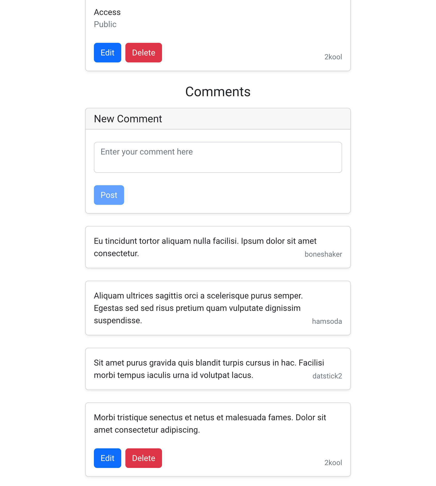
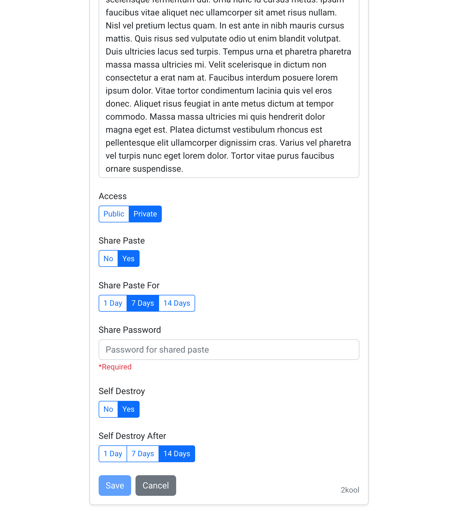
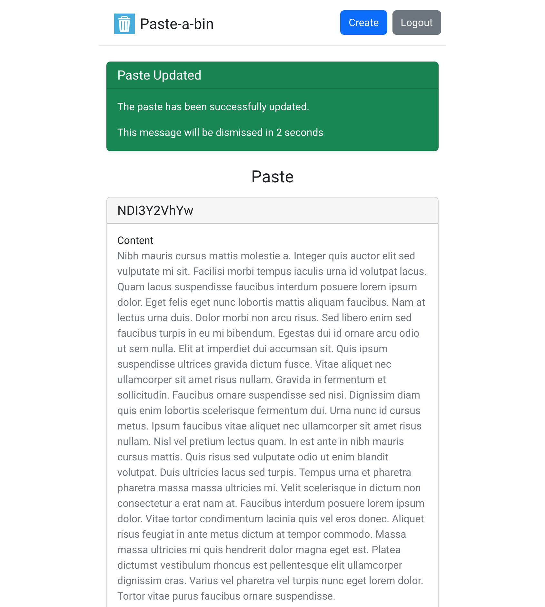
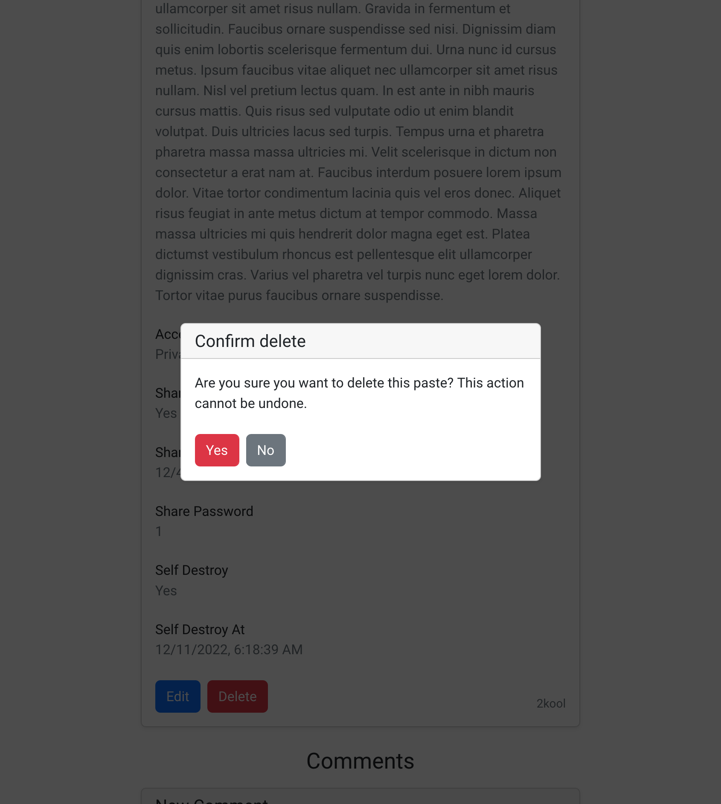

# Paste-a-bin

## Project objective

An app for users to save snippets of pasted content and share to others, optionally protected with a password and time limit.

### Home

This is the landing page. It shows the latest pastes on the site and the user's pastes if the user is logged in. 

### Paste

The page shows details of a paste and its comments, with the ability to edit and delete.

### Login

The page is used to log in.

## Screenshots

## Tech requirements
- Linux server with Docker installed
- a modern web browser

## How to install / use

### For users

You don't need to install anything to use the project. Just visit it via [this link](https://paste-a-bin.lol).

### For developers

- Clone the project from GitHub: `git clone git@github.com:timothyq/drop-a-bin.git`
- Development:
  - Have a mongo instance running and set mongo instance details in `set-local-env.sh`
  - Start dev server: `npm run start-dev`, the website will be available on `http://localhost:3000`
- Deployment:
  - Build the front-end: `npm run build -w paste-a-bin-client`
  - Deploy: `cd deploy; sh deploy.sh YOUR_MONGO_USERNAME YOUR_MONGO_PASSWORD`, the website will be available on `http://localhost`

## Class

This project is created as an assignment for the [CS 5610 Web Development](https://johnguerra.co/classes/webDevelopment_fall_2022/) class offered by Northeastern University.

## Design document

The design document is available [here](Design%20Document.pdf)  design document isn't updated for project four, need to bring it up to date

## Video demonstration

A [video demonstration](https://www.youtube.com/watch?v=os4upGRLYnE) is available.

## Author

[eqiowtj](https://eqiowtj.github.io/homepage/index.html)
[timothyq](https://cs5610sv22f-p4oy.vercel.app/index.html)

## License

This project is distributed under the [MIT License](LICENSE).
